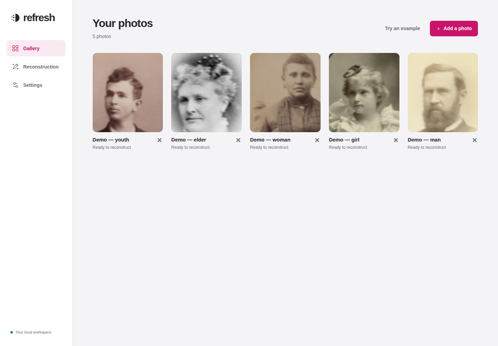
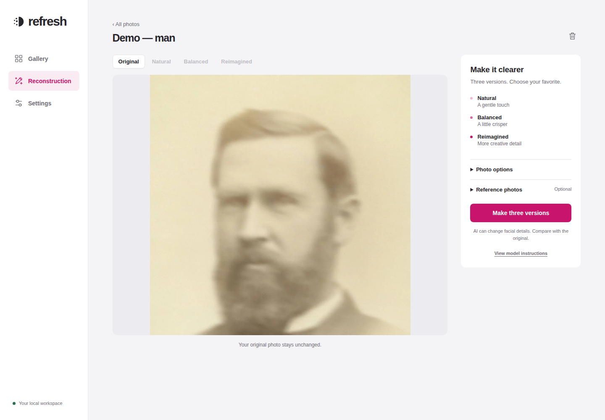
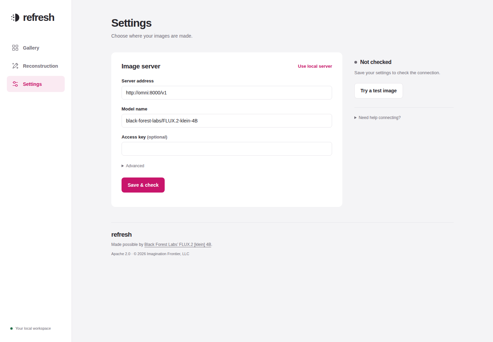

# refresh — self hosted

**Give a blurry portrait a clearer look, on your own setup.**

This is the open-source, self-hosted edition distilled from
**[refresh.stream](https://refresh.stream)**, our hosted photo reconstruction product.
It keeps the core photo tools in a simpler workspace you run yourself.

refresh makes three interpretations of a photo: **Natural**, **Balanced** and
**Reimagined**. Compare them, download the one you like, or make another pass.
You can add clear photos of the same person to help with likeness. AI can invent
details; these images are reconstructions, not proof of what the original showed.

This edition is for one person using one local library. There is no sign-in,
subscription or separate account storage. Your photos, results and work records
live in an ordinary `data` folder beside the project. You can read the exact
instructions sent to the model and see what happened during each request.

Thanks to **[Black Forest Labs](https://huggingface.co/black-forest-labs/FLUX.2-klein-4B)**
for making **FLUX.2 [klein] 4B** available under **Apache 2.0**. That release makes
this project possible. Model weights are downloaded separately; this project is
not affiliated with or endorsed by Black Forest Labs.

## A look inside

**Gallery** — keep your photos together and choose one to work on.



**Reconstruction** — choose a photo, adjust its framing and make three versions.



**Settings** — choose your image server and check that it can make images.



These screenshots use the [credited demo portraits](web/examples/README.md).
The reconstruction screen shows an original photo before processing; Settings
shows the defaults before a connection check.

## What you need

- **Docker with Docker Compose**: the tool that runs the app for you. Docker Desktop
  includes both on Mac/Windows. On Linux, install Docker Engine and its Compose plugin.
- **An image server** to make new images. This is a computer or service running the
  model. You can connect to an existing vLLM-Omni server, or use our optional
  [DGX Spark / GB10 setup](docs/LOCAL_IMAGE_SERVER.md).

You can start the app and explore the bundled examples before connecting an image
server. Missing or broken connections produce an error; saved examples are never
presented as newly generated results.

## Start the app

Open a terminal in this project folder. On Linux or macOS:

```sh
mkdir -p data
cp .env.example .env
docker compose up -d --build --wait
```

Open **[http://localhost:7520](http://localhost:7520)** in your browser.
The first launch downloads the app's dependencies and can take a few minutes.
On Windows, create a folder named `data` and copy `.env.example` to `.env` in File
Explorer first, then run the Docker command in PowerShell.

On Linux, the app runs as user/group `1000:1000` by default. If your user has
different numbers, run `id -u` and `id -g`, then put their outputs in `.env` as
`LOCAL_UID` and `LOCAL_GID`. The `data` folder must be writable by that user.
If startup reports a permission error, correct those values and try again.

### Use a ready-made app package

Once a release's Docker package has been published, you can download the app
instead of building it. In `.env`, add its version, for example:

```dotenv
REFRESH_VERSION=0.1.0-preview.1
```

Then start it with:

```sh
docker compose -f compose.yaml -f compose.package.yaml pull app
docker compose -f compose.yaml -f compose.package.yaml up -d --no-build --wait app
```

Use those same two `-f` options when stopping the app or viewing logs. Your `data`
folder and settings work the same way. The package includes the app and demo
portraits; you still need an image server to create new results. See the
[optional GPU setup](docs/LOCAL_IMAGE_SERVER.md#using-the-ready-made-app-package)
to run the package alongside a local server.

For an update, back up `data`, change `REFRESH_VERSION` to the new published
version, then repeat the two commands. Check the release notes before updating.
Source archives from the first preview predate this shortcut; use a current
checkout of this repository for these instructions.

### Choose a photo

1. Open **Settings**, enter your image-server address and model, then choose
   **Save & check**. Use **Try a test image** to verify image creation.
2. Open **Gallery** and choose **Add a photo** or **Try an example**.
3. In **Reconstruction**, choose **Make three versions**. Optional cropping and
   reference photos are under **Photo options** and **Reference photos**.
4. Switch between the finished versions, compare with the original and download
   the one you like. Previous reconstructions stay with that photo.

The app opens straight into your gallery. Each photo has its own reconstruction
workspace; Settings holds connection checks and test images. You can bookmark a
photo's address and return to it later.

**Natural** stays conservative. **Balanced** makes another pass over Natural to
clean up existing lines. **Reimagined** allows more invented detail and may change
likeness. Each finished version has a comparison slider, PNG download, refinement
button and a **View details** panel with its instructions and work record. Repeated refinement can change a
face further; check the original as you go.

## Where your files go

```text
data/
  settings.json           Your image-server settings, including any saved access key
  photos/<photo-id>/       Original file, preview, thumbnail and readable description
  jobs/<job-id>/           Prepared inputs, results, exact prompts and progress record
  models/                 Model downloads, if you use the optional local image server
  inference-cache/        Temporary model files for that optional server
```

There is one shared library, no account folders and no separate database service.
Originals are kept unchanged; prepared images and results have personal metadata
removed. The `original` file keeps the uploaded bytes without renaming them to a
new image format; open it with an image viewer. Results are stored as high-quality
WebP and converted to PNG for download. Nothing expires automatically. Use Delete
in the app to remove a photo and all work that uses it, or delete individual
reconstructions. Deleting an original or reference also deletes dependent work.

**Back up:** stop the app, copy `data` somewhere safe, then start it again. Copying
only the images will lose settings and work history. To restore, stop the app and
replace `data` with your backup. Do not edit its records while the app is running.
Your saved access key is readable to people with access to that folder or backups;
the app never sends it back to the browser. `.env`, `data` and test outputs are
excluded from Git and from the app's container build.

## Everyday commands

Run these from the project folder:

```sh
# Stop the app. Your data stays on disk.
docker compose down

# Start again, or rebuild after changing the code.
docker compose up -d --build --wait

# See progress and startup errors. Press Ctrl+C to stop watching.
docker compose logs -f app

# Run automated checks; no GPU is needed.
docker compose --profile test run --build --rm tests
```

If you use the optional GPU server, use the two-file commands in its
[setup guide](docs/LOCAL_IMAGE_SERVER.md) when starting or stopping the stack.

## A personal workspace, not a public photo service

By default, the app is reachable only on the computer running it. There is **no
login**: anyone you allow to connect can view/delete the library and change the
image-server settings. Keep this edition off the public internet. To serve unrelated
customers, you need the additional boundaries described in the
[plain-language architecture comparison](docs/ARCHITECTURE.md).

For access from a trusted local network, set `BIND_ADDRESS=0.0.0.0` in `.env` and
add your exact browser address to `ALLOWED_ORIGINS`, for example
`http://your-computer:7520`. Restart the app. Changing `PORT` also requires updating
those allowed addresses. This does not add passwords or separate libraries.
Photos leave this app only when sent to the image server you choose. There are no
analytics, externally hosted scripts, Clerk, Stripe or Turnstile integrations here.
Only upload photos you have permission to process.

## Examples, transparency and contributing

Five built-in historical portraits include saved before/after versions and links
to their source archives. Their rights labels distinguish **public domain** from
**no known copyright restrictions**. See [example credits](web/examples/README.md).
These are inherited demonstration assets, not a benchmark of today's prompts.

- [How the app works, and how it differs from the hosted product](docs/ARCHITECTURE.md)
- [Optional DGX Spark / GB10 image server](docs/LOCAL_IMAGE_SERVER.md)
- [Contributing and running browser checks](CONTRIBUTING.md)
- [Build and verification notes](WORK_LOG.md)
- [Publishing releases and Docker packages](docs/RELEASING.md)

The software is **[Apache-2.0](LICENSE)**, copyright 2026 **Imagination Frontier,
LLC**. Outside contributions require the separate [copyright assignment and
license agreement](CONTRIBUTOR_AGREEMENT.md); that template needs legal review
before accepting outside contributions. Third-party assets retain their stated
rights and notices. See [NOTICE](NOTICE).
