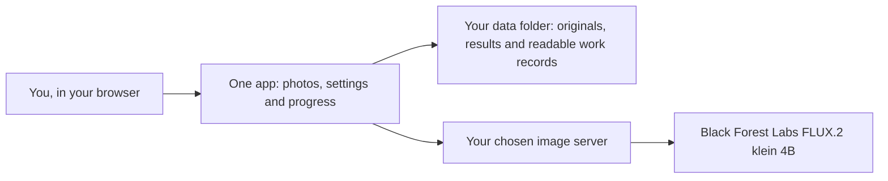
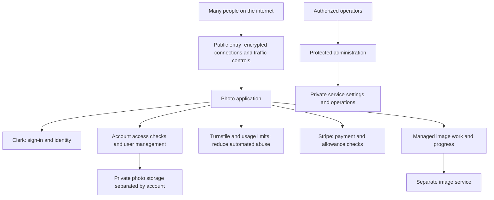

# Two shapes, for two different needs

The self-hosted edition is a personal workspace. The hosted product has to serve
many unrelated people over the internet. That requires more boundaries around
identity, payments, photo access and administration.

## Self hosted: one person, one library

Docker Compose starts the app and, optionally, the image server. The app serves
its own pages; no separate website build or database service is needed. The
`data` folder is mounted into the app, which means the files are ordinary files
you can open and back up on your computer.

There are no accounts, passwords, payments, customer quotas or separate customer
folders. Anyone who can reach the app has access to the whole library and settings.
By default, only browsers on the same computer can connect. Browser-origin checks
help reject unwanted requests from other websites; they do not identify users.

## Hosted product: boundaries for a public service

These extra controls make the hosted design better suited to a public service:
identity checks tie requests to accounts, access checks keep one person's photos
away from another, payment checks control paid use, and a separate administration
boundary protects service settings. Their effectiveness still depends on correct
configuration and operation; a diagram is not a security audit.

This is a high-level comparison. It deliberately omits private deployment addresses,
internal storage layouts, database tables, credentials and operating procedures.
The hosted account, payment and administration implementation is not included here.

## What happens when you make images

1. Keep the uploaded original unchanged. Read its orientation and color profile.
2. Prepare the selected area on a 1024 × 1024 canvas, with neutral padding when needed.
3. Send that image, optional reference photos and the visible instructions to the image server.
4. Make **Natural** from the original; make **Balanced** from Natural with a line-cleanup instruction; make **Reimagined** from the original with more freedom to invent detail.
5. Match overall brightness and color back to the original, remove padding and save the result as WebP. Downloads are PNG.

Work records contain the instructions, model name, random seed, framing, timing,
failures and result ancestry. An exact seed does not guarantee identical output
across model/server versions. Work is processed one request at a time. If a request
loses its connection, the app waits for the owner to check the image server before
allowing another request. It does not retry silently.
